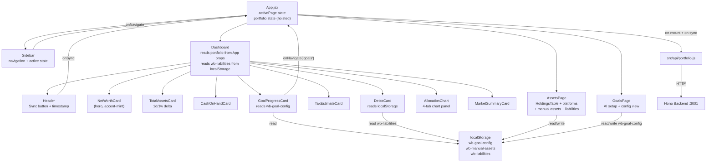

# Design: Iteration 1 — MVP

> **Iteration 1** | Requires: [spec.md](./spec.md)

---

## Architecture Overview



**Data flow:**
- `App.jsx` owns both `activePage` and `portfolio` state. Portfolio state is hoisted to App so `AssetsPage` can access holdings without re-fetching. `App` passes portfolio down as props to Dashboard and AssetsPage.
- `Sidebar` calls `onNavigate(page)` → `App` updates `activePage`.
- Dashboard child cards are all pure render components. `DebtsCard` and `GoalProgressCard` read localStorage synchronously on render — no async.
- `AssetsPage` writes to localStorage; `DebtsCard` on Dashboard re-reads `wb-liabilities` on each render (localStorage reads are synchronous and cheap).

---

## Dashboard Layout

```
┌─────────────────── Header (full width) ────────────────────────────┐
│  Wealth Butler                          [Last synced: ...] [Sync]  │
└────────────────────────────────────────────────────────────────────┘
┌──────────────── Row 1: Summary Cards (5 cards) ────────────────────┐
│ ┌──────────────┐ ┌──────────────┐ ┌────────────┐ ┌────────────────┐│
│ │  Net Worth   │ │ Total Assets │ │Cash on Hand│ │     Debts      ││
│ │  $X.XX M     │ │  $X.XX M     │ │  $XXX,XXX  │ │    $XX,XXX     ││
│ │  ─────────   │ │  1d: -X (X%)│ │            │ │  1d: $0        ││
│ │  Investable  │ │  1w: +X (X%)│ │            │ │  1w: +X (X%)   ││
│ │  $X.XX M     │ │             │ │            │ │                ││
│ └──────────────┘ └──────────────┘ └────────────┘ └────────────────┘│
│ ┌──────────────────────────────┐                                   │
│ │       Tax Estimate           │                                   │
│ │       $XX,XXX                │                                   │
│ │  Adjusted Net Worth: $X.XX M │                                   │
│ └──────────────────────────────┘                                   │
└────────────────────────────────────────────────────────────────────┘
┌──────────────── Row 2: Goal Progress ──────────────────────────────┐
│  [GoalProgressCard — accent purple — full width]                   │
└────────────────────────────────────────────────────────────────────┘
┌──────────────── Row 3: Charts + AI Summary ────────────────────────┐
│ ┌─────────────────────────────┐  ┌──────────────────────────────┐ │
│ │  AllocationChart            │  │  MarketSummaryCard           │ │
│ │  [Tab: Stock | All | Crypto │  │  [AI-generated market update]│ │
│ │   | Investable ex-cash]     │  │                              │ │
│ │  [Pie chart]                │  │                              │ │
│ └─────────────────────────────┘  └──────────────────────────────┘ │
└────────────────────────────────────────────────────────────────────┘
```

---

## Navigation Approach

State-based page routing — no React Router. `App.jsx` holds:

```js
const [activePage, setActivePage] = useState('dashboard')
const [portfolio, setPortfolio] = useState(null)
const [loading, setLoading] = useState(true)
const [syncing, setSyncing] = useState(false)
```

Portfolio state is hoisted to App (not Dashboard) because `AssetsPage` also needs holdings. Dashboard and AssetsPage receive portfolio as props.

```jsx
{activePage === 'dashboard'    && <Dashboard portfolio={portfolio} loading={loading} syncing={syncing} onNavigate={setActivePage} onSync={handleSync} />}
{activePage === 'assets'       && <AssetsPage holdings={portfolio?.holdings} loading={loading} />}
{activePage === 'goals'        && <GoalsPage />}
{activePage === 'ai-advisor'   && <ComingSoonPage label="AI Advisor" />}
{activePage === 'integrations' && <ComingSoonPage label="Integrations" />}
```

---

## Components

### App (updated)
- **Purpose:** Root shell; owns `activePage` + portfolio state; renders Sidebar + active page
- **Location:** `src/App.jsx`
- **State:** `activePage`, `portfolio`, `loading`, `syncing`
- **Behaviour:** Fetches portfolio on mount; passes portfolio + handlers to Dashboard and AssetsPage

---

### Sidebar (updated)
- **Purpose:** Navigation spine; highlights active page per DESIGN-SYSTEM.md accent mapping
- **Location:** `src/components/Sidebar.jsx`
- **Props:** `{ activePage: String, onNavigate: Function }`

---

### Dashboard (refactored in T11)
- **Purpose:** Renders all Dashboard sections; derives `debtsTotal` from localStorage; passes `onNavigate` to GoalProgressCard
- **Location:** `src/components/Dashboard.jsx`
- **Props:** `{ portfolio, loading, syncing, onNavigate, onSync }`
- **Derived values computed in Dashboard:**
  ```js
  const debtsTotal = JSON.parse(localStorage.getItem('wb-liabilities') || '[]')
    .reduce((sum, l) => sum + l.valueAUD, 0)
  const netWorth = (portfolio?.assetsTotal ?? 0) - debtsTotal
  const investable = portfolio?.holdings
    .filter(h => h.assetType !== 'cash')
    .reduce((sum, h) => sum + h.valueAUD, 0) ?? 0
  ```

---

### NetWorthCard (extended in T11)
- **Location:** `src/components/NetWorthCard.jsx`
- **Props:** `{ netWorth: Number|null, investable: Number|null, loading: Boolean }`
- **Design:** Hero card, accent-mint, 6px hard-offset shadow

---

### TotalAssetsCard (new — T11)
- **Location:** `src/components/TotalAssetsCard.jsx`
- **Props:**
  ```js
  { assetsTotal: Number|null, delta1d: Number|null, delta1dPct: Number|null,
    delta1w: Number|null, delta1wPct: Number|null, loading: Boolean }
  ```
- **Behaviour:** Delta colour: positive → `#00c48c`, negative → `#e63946`, zero → `#888888`

---

### CashOnHandCard (new — T11)
- **Location:** `src/components/CashOnHandCard.jsx`
- **Props:** `{ cashOnHand: Number|null, loading: Boolean }`

---

### DebtsCard (new — T11)
- **Location:** `src/components/DebtsCard.jsx`
- **Props:** `{ debtsTotal: Number, loading: Boolean }`
- **Behaviour:** Shows main debts total; delta values shown as `$0` / zero until historical data is available (MVP limitation)

---

### TaxEstimateCard (new — T11)
- **Location:** `src/components/TaxEstimateCard.jsx`
- **Props:** `{ taxEstimate: Number|null, adjustedNetWorth: Number|null, loading: Boolean }`
- **Behaviour:** Shows "No cost basis data" with dashed border when `taxEstimate` is null

---

### AllocationChart (updated — T12)
- **Purpose:** 4-tab configurable chart panel
- **Location:** `src/components/AllocationChart.jsx`
- **Props:** `{ holdings: Array, loading: Boolean }`
- **State:** `chartType` (default `'stock-sectors'`)

---

### MarketSummaryCard
- **Location:** `src/components/MarketSummaryCard.jsx`
- **Props:** `{ aiSummary: String|null, loading: Boolean, apiKeyMissing: Boolean }`
- **Design:** Accent-sand card

---

### GoalProgressCard (new — T13)
- **Location:** `src/components/GoalProgressCard.jsx`
- **Props:** `{ netWorth: Number|null, onNavigate: Function }`
- **Design:** Accent-purple card, full-width in Dashboard Row 2

---

### AssetsPage (new — T14)
- **Purpose:** Holdings table + platform connections + manual assets + liabilities
- **Location:** `src/components/AssetsPage.jsx`
- **Props:** `{ holdings: Array, loading: Boolean }`
- **Sections:** Holdings table | Platform connections | Manual assets | Liabilities

---

### GoalsPage (new — T15)
- **Location:** `src/components/GoalsPage.jsx`
- **Props:** none
- **Design:** Accent-purple throughout; `Sparkles` icon on AI-guided heading

---

### API Client
- **Location:** `src/api/portfolio.js`
- **Exports:** `fetchPortfolio()` · `syncPortfolio()`

---

## Data Models

### Portfolio Response (from backend)
```js
{
  assetsTotal: Number,      // sum of all holding values — NEW
  netWorth: Number,         // assetsTotal (backend doesn't know about local debts; computed in Dashboard)
  cashOnHand: Number,       // sum of holdings where assetType === 'cash' — NEW
  taxEstimate: Number|null, // CGT estimate; null if no cost basis data — NEW
  delta: {                  // NEW
    assets1d:    Number,    // AUD change from previous close
    assets1dPct: Number,    // % change from previous close
    assets1w:    Number,    // AUD change from 7 days ago
    assets1wPct: Number,    // % change from 7 days ago
  },
  lastUpdated: String|null,
  holdings: [
    {
      ticker: String,
      exchange: String,       // "IBKR-BIZ" | "IBKR-PERSONAL" | "COINSPOT"
      qty: Number,
      price: Number,          // AUD per unit
      valueAUD: Number,
      sector: String,         // e.g. "Technology", "Crypto", "Other"
      assetType: String,      // "stock" | "crypto" | "cash" | "other" — NEW
      allocation: Number,     // 0–100
    }
  ],
  aiSummary: String|null,
  errors: [{ source: String, message: String }]
}
```

> **Backend note:** `assetsTotal`, `cashOnHand`, `taxEstimate`, `delta`, and `assetType` per holding are new fields required by the redesigned Dashboard. These must be implemented in the Hono backend before T11 can be fully functional. Until then, T11 can be built with derived/mock values.

### Goal Config (`localStorage` `wb-goal-config`)
```js
{
  targetAUD: Number,
  targetYear: Number,
  annualSavings: Number,
  monthlySavingsRequired: Number,
  notes: String,  // AI narrative or "Manually calculated"
}
```

### Manual Asset (`localStorage` `wb-manual-assets` — array)
```js
{ id: String, name: String, type: 'Cash'|'Property'|'Super'|'Other', valueAUD: Number }
```

### Liability (`localStorage` `wb-liabilities` — array)
```js
{ id: String, name: String, type: 'Mortgage'|'Loan'|'Credit Card'|'Other', valueAUD: Number }
```

---

## Error Handling Strategy

| Scenario | Handling |
|----------|----------|
| `fetchPortfolio` network error | `loading = false`, `error = message`, stale portfolio preserved |
| `syncPortfolio` network error | `syncing = false`, error banner shown, `lastUpdated` NOT changed |
| `portfolio.errors[]` non-empty | Warning badges in Header per source; data still displayed |
| `taxEstimate === null` | TaxEstimateCard shows "No cost basis data" dashed-border state |
| `delta` fields absent (backend not yet updated) | Cards show delta as "–" rather than crashing |
| `holdings` is empty | AllocationChart shows "No data"; AssetsPage holdings table shows empty state |
| Claude API fails (GoalsPage) | Inline error; answers preserved; retry button |
| Claude API key absent (GoalsPage) | Client-side calculation fallback |
| localStorage read fails | Treat as empty array; app does not crash |

---

## Tech Decisions

| Decision | Choice | Reason |
|----------|--------|--------|
| Portfolio state hoisted to App | `useState` in App.jsx | AssetsPage needs holdings without re-fetching |
| Page routing | `useState` in App.jsx | MVP simplicity; no URL requirements |
| Debts/goal persistence | `localStorage` | Client-only data; zero backend setup |
| DebtsCard reads localStorage on render | Synchronous read | Avoids prop-drilling liabilities up through App; localStorage reads are instant |
| Chart panel state | `useState` in AllocationChart | Local UI state only |
| Delta colours | Inline style / conditional Tailwind class | Values known at render time; no theme extension needed |
| `assetType` field | Explicit field on holding | Cleaner than inferring from sector/exchange string |
