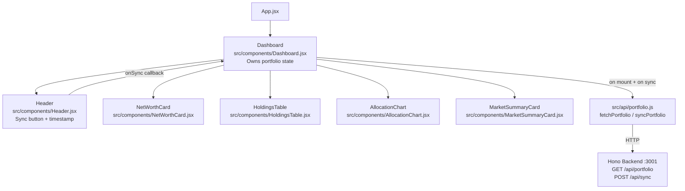

# Design: MVP Dashboard

> **Iteration 1** | Requires: [spec.md](./spec.md)

---

## Architecture Overview



**Data flow:** Dashboard owns all state. On mount it calls `fetchPortfolio()`. On sync click it calls `syncPortfolio()`, both provided by the API client. All child components are pure — they receive props and render.

---

## Code Reuse Analysis

| Existing Asset | Location | How Used |
|----------------|----------|----------|
| `recharts` | `node_modules/recharts` | `PieChart`, `Pie`, `Cell`, `Tooltip` in AllocationChart |
| `lucide-react` | `node_modules/lucide-react` | `RefreshCw` (sync spinner), `AlertCircle` (error), `Clock` (timestamp) |
| Tailwind CSS | `tailwind.config.js` | All layout, spacing, colour, and typography |
| `Intl.NumberFormat` | Browser native | AUD currency formatting — no extra dependency |
| `src/index.css` | Existing | Tailwind base/components/utilities already imported |

No new libraries required. Everything needed is already in `package.json`.

---

## Components

### Dashboard
- **Purpose:** Root layout; owns `portfolio` state, `loading`, `error`, and `lastSync` state; coordinates child renders
- **Location:** `src/components/Dashboard.jsx`
- **Props:** none (top-level component)
- **State:**
  ```js
  portfolio: { netWorth, lastUpdated, holdings, aiSummary, errors } | null
  loading: Boolean
  syncing: Boolean
  error: String | null
  ```
- **Behaviour:** Calls `fetchPortfolio()` on mount; passes `onSync` handler to Header; distributes data to children

---

### Header
- **Purpose:** App title, Sync button, last-updated timestamp, partial-failure warning badges
- **Location:** `src/components/Header.jsx`
- **Props:**
  ```js
  { lastUpdated: String|null, syncing: Boolean, errors: Array, onSync: Function }
  ```
- **Behaviour:** Renders `SyncButton` (disabled + spinner when `syncing`); formats `lastUpdated` with `Intl.DateTimeFormat`; maps `errors` to warning badges per source

---

### NetWorthCard
- **Purpose:** Displays total AUD net worth in a prominent card
- **Location:** `src/components/NetWorthCard.jsx`
- **Props:**
  ```js
  { netWorth: Number|null, loading: Boolean }
  ```
- **Behaviour:** Formats with `Intl.NumberFormat('en-AU', { style: 'currency', currency: 'AUD' })`; renders Tailwind skeleton div when `loading` is true

---

### HoldingsTable
- **Purpose:** Sortable table of all holdings across all sources
- **Location:** `src/components/HoldingsTable.jsx`
- **Props:**
  ```js
  { holdings: Array, loading: Boolean }
  ```
- **Columns:** Ticker/Coin | Exchange | Qty | Price (AUD) | Value (AUD) | Allocation %
- **Behaviour:** Default sort: `valueAUD` descending; renders skeleton rows when `loading`; empty state row when `holdings` is empty and not loading

---

### AllocationChart
- **Purpose:** Recharts pie chart showing portfolio value by sector
- **Location:** `src/components/AllocationChart.jsx`
- **Props:**
  ```js
  { holdings: Array, loading: Boolean }
  ```
- **Behaviour:** Groups holdings by `sector` (fallback: "Other"); computes each sector's % of `netWorth`; uses Recharts `PieChart` + `Pie` + `Cell` + `Tooltip`; renders skeleton when `loading`

---

### MarketSummaryCard
- **Purpose:** Displays Claude-generated market summary; skeleton when unavailable
- **Location:** `src/components/MarketSummaryCard.jsx`
- **Props:**
  ```js
  { aiSummary: String|null, loading: Boolean, apiKeyMissing: Boolean }
  ```
- **Behaviour:** Shows text when `aiSummary` is a non-empty string; shows skeleton when `loading`; shows "AI summary unavailable" message when `apiKeyMissing`

---

### API Client
- **Purpose:** HTTP wrapper for backend calls; single import for all API interactions
- **Location:** `src/api/portfolio.js`
- **Exports:**
  ```js
  fetchPortfolio()  // GET /api/portfolio → portfolio object
  syncPortfolio()   // POST /api/sync → portfolio object
  ```
- **Behaviour:** Uses `import.meta.env.VITE_API_URL` (default `http://localhost:3001`); throws on non-2xx responses so Dashboard can catch and set error state

---

## Data Models

### Portfolio Response (from backend)
```js
// GET /api/portfolio or POST /api/sync response
{
  netWorth: Number,           // AUD total, e.g. 123456.78
  lastUpdated: String | null, // ISO-8601, e.g. "2026-06-01T10:00:00.000Z"
  holdings: [
    {
      ticker: String,         // e.g. "AAPL" or "BTC"
      exchange: String,       // "IBKR-BIZ" | "IBKR-PERSONAL" | "COINSPOT"
      qty: Number,            // e.g. 10.5
      price: Number,          // AUD per unit
      valueAUD: Number,       // qty × price
      sector: String,         // e.g. "Technology", "Crypto", "Other"
      allocation: Number,     // 0–100, percentage of netWorth
    }
  ],
  aiSummary: String | null,   // 2–3 sentence summary, null if unavailable
  errors: [
    {
      source: String,         // "IBKR" | "COINSPOT" | "AI"
      message: String,        // human-readable error description
    }
  ]
}
```

### Empty / First-Load State
```js
// Dashboard initial state before any fetch completes
portfolio = null
loading = true
error = null
```

### Error State
```js
// Sync failed completely
portfolio = <last known value>  // preserved
error = "Failed to sync: <message>"
```

---

## Error Handling Strategy

| Scenario | Handling |
|----------|----------|
| `fetchPortfolio` network error | `loading = false`, `error = message`, stale `portfolio` preserved |
| `syncPortfolio` network error | `syncing = false`, error banner shown, `lastUpdated` NOT changed |
| `portfolio.errors[]` non-empty | Warning badges shown in Header per source; data still displayed |
| `aiSummary === null` + key missing | `apiKeyMissing` prop passed to MarketSummaryCard |
| `holdings` is empty | HoldingsTable shows empty-state row; AllocationChart shows empty state |

---

## Tech Decisions

| Decision | Choice | Reason |
|----------|--------|--------|
| State location | `useState` in Dashboard | MVP simplicity; no cross-component sharing needed |
| Chart library | Recharts `PieChart` | Already in `package.json`; no additional dep |
| Number formatting | `Intl.NumberFormat('en-AU')` | Native browser API; zero bundle cost |
| Date formatting | `Intl.DateTimeFormat('en-AU')` | Native; consistent with number formatting approach |
| API base URL | `VITE_API_URL` env var | Vite env pattern; allows override without code change |
| Skeleton loading | Tailwind `animate-pulse` div | No extra library; consistent with Tailwind-first approach |
| Component style | Pure function components | Consistent with React 18 + existing `App.jsx` pattern |
